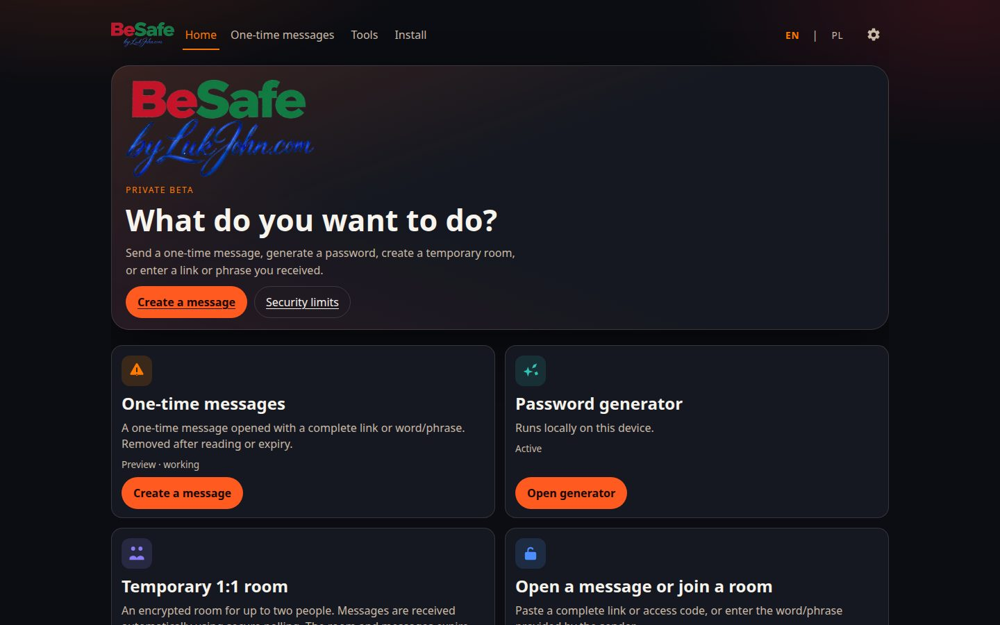
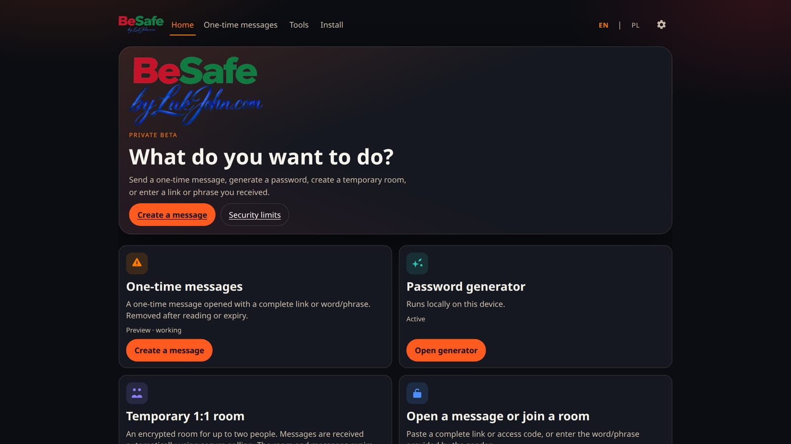
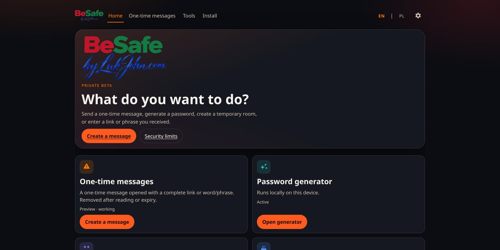
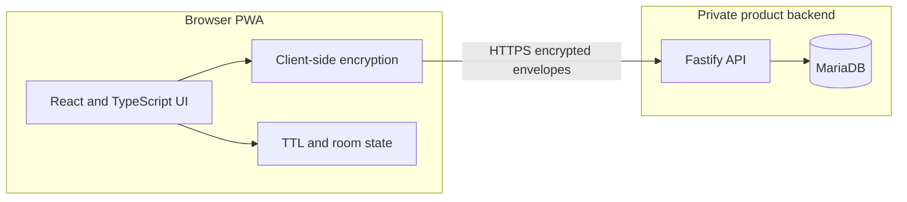

# BeSafe — portfolio code samples

Public portfolio sample — source-available for review, not open source.

This repository contains isolated UI and internationalization examples.
It is not the complete BeSafe product and cannot be built or deployed as BeSafe.

The complete product repository remains private.

- Production: [https://besafe.lukjohn.com/](https://besafe.lukjohn.com/)
- Preview: [https://preview.besafe.lukjohn.com/](https://preview.besafe.lukjohn.com/)
- Portfolio: [https://www.lukjohn.com/en/projects/besafe/](https://www.lukjohn.com/en/projects/besafe/)

  

## Project overview

BeSafe is a bilingual privacy-focused PWA for one-time encrypted messages and temporary encrypted 1:1 rooms.

The current Room Core is available as a production Beta. It uses client-side encryption, HTTPS polling, encrypted message envelopes, server-authoritative TTL, automatic cleanup, delivery receipts and optional privacy-controlled seen receipts.

The complete product implementation, backend, cryptographic code, database schema and deployment configuration remain private.

## Screenshots

| Home | Portfolio still |
| --- | --- |
|  |  |

GitHub social preview (1280×640):

## Verified technology

Technologies used by the complete private product:

- React
- TypeScript
- Vite
- Progressive Web App
- Service Worker
- Node.js
- TypeScript API
- Fastify
- MariaDB / InnoDB
- HTTPS polling
- Client-side encryption
- Server-authoritative TTL
- PL / EN internationalization
- Responsive desktop, tablet and mobile interface

Only isolated UI, type and internationalization samples are included in this public repository.

## Feature status

| Area | Lane | Status |
| --- | --- | --- |
| Password and passphrase generator | Core | Active |
| One-time encrypted messages | Core | Active |
| Messages opened through a complete link | Core | Active |
| Messages opened through a phrase | Core | Active |
| TTL and burn-after-reading | Core | Active |
| Installable PWA | Core | Active |
| Temporary encrypted 1:1 room | Core / Beta | Working in production |
| Maximum two room participants | Core / Beta | Working |
| Delivery receipts | Core / Beta | Working |
| Optional seen receipts | Core / Beta | Working |
| Live room expiration countdown | Core / Beta | Working |
| Network reconnect and polling catch-up | Core / Beta | Working |
| Opaque capability links | Core / Beta | Working |
| BSAFE1 access codes | Core / Beta | Working |
| WebSocket transport | Pro roadmap | Not implemented |
| Double Ratchet | Pro roadmap | Not implemented |
| Forward secrecy | Pro roadmap | Not implemented |
| Post-compromise security | Pro roadmap | Not implemented |
| Safety number / identity verification | Pro roadmap | Not implemented |
| Independent security audit | Security gate | Not completed |

## High-level architecture

See [docs/architecture.md](docs/architecture.md).

## Security limitations

BeSafe is not currently presented as an independently audited or production-ready secure messenger.

Not implemented:

- WebSocket transport
- Double Ratchet
- Forward secrecy
- Post-compromise security
- Safety-number identity verification
- Independent security audit

The current production Beta uses client-side encryption and HTTPS polling. The API stores ciphertext and operational metadata. This is not a claim of anonymity or resistance to every form of device, browser, server or supply-chain compromise.

## What this repository contains

- A professional portfolio README
- Public product screenshots
- A high-level architecture description
- Isolated React UI components
- Isolated TypeScript types
- A small PL / EN internationalization example
- Mock feature status data

Review notes: [samples/README.md](samples/README.md).

## What this repository does not contain

- The complete BeSafe application
- Complete frontend source code
- Backend or API implementation
- Production cryptographic implementation
- Key-management code
- Room protocol implementation
- Database schema or migrations
- Deployment scripts
- Server configuration
- Environment files
- Credentials, secrets or production data
- Private protocol and integration tests

## Reviewing the samples

Read [samples/README.md](samples/README.md). There is no install/run path. Open Production or Preview to see the working UI.

## Copyright and usage

Copyright © 2026 Łukasz Chudy / LukJohn.com.
All rights reserved.

This repository is a public source-available sample for portfolio and code review.
It is not an open-source distribution.

No permission is granted to copy, modify, distribute, sublicense,
or use this code in another product without prior written permission.

See [NOTICE.txt](NOTICE.txt).
