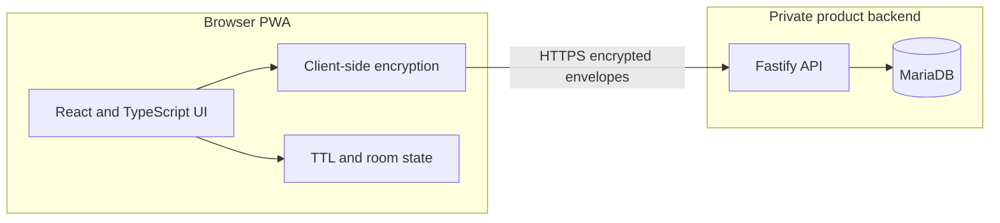

# BeSafe — high-level architecture (portfolio)

This diagram describes the **public product shape**. It is not a deployable design and does not include protocol, key-management, or server internals.

## Current transport

The current Room Core uses HTTPS polling with reconnect and sequence-based catch-up. WebSocket transport is not implemented.

## Current cryptographic limitations

The current room does not implement Double Ratchet, forward secrecy, post-compromise security or independently audited identity verification.

## Pro roadmap

The planned Pro security lane includes authenticated session establishment, WebSocket transport with HTTPS polling fallback, Double Ratchet, identity verification, safety numbers and an independent security review.

## Boundaries shown here

- Encryption happens in the browser. The API is designed to receive encrypted envelopes, not message plaintext.
- Preview and Production are separate environments. This sample repository does not contain either.
- Room Core is a production Beta. It is not presented as an audited or Signal-grade messenger.

## Intentionally omitted

Backend routes, database schema, migrations, cryptographic primitives, room protocol, deployment, and environment configuration are **not** in this repository.
